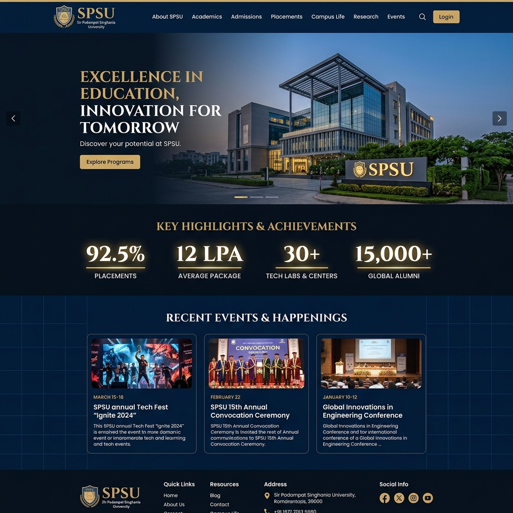
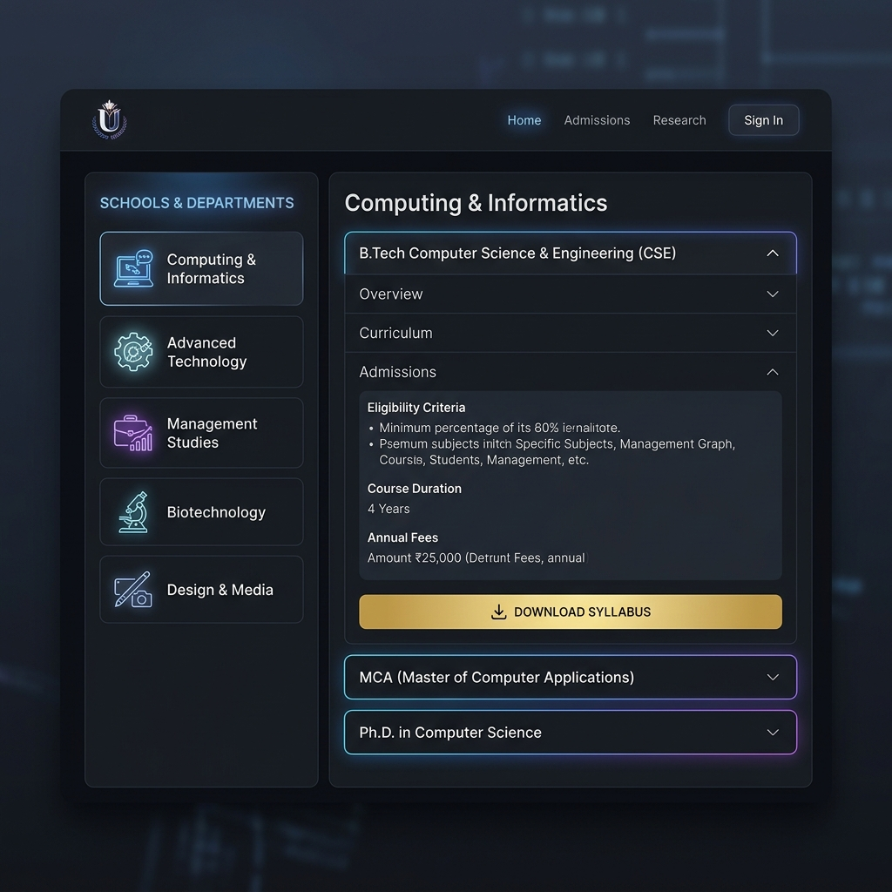
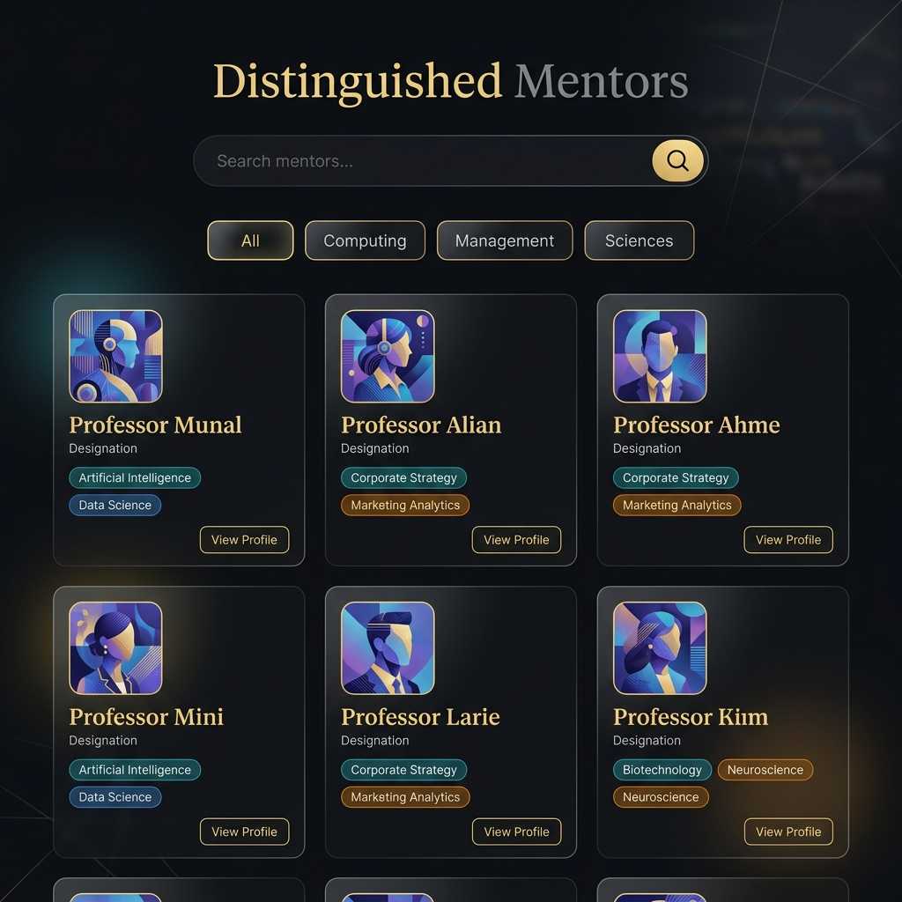
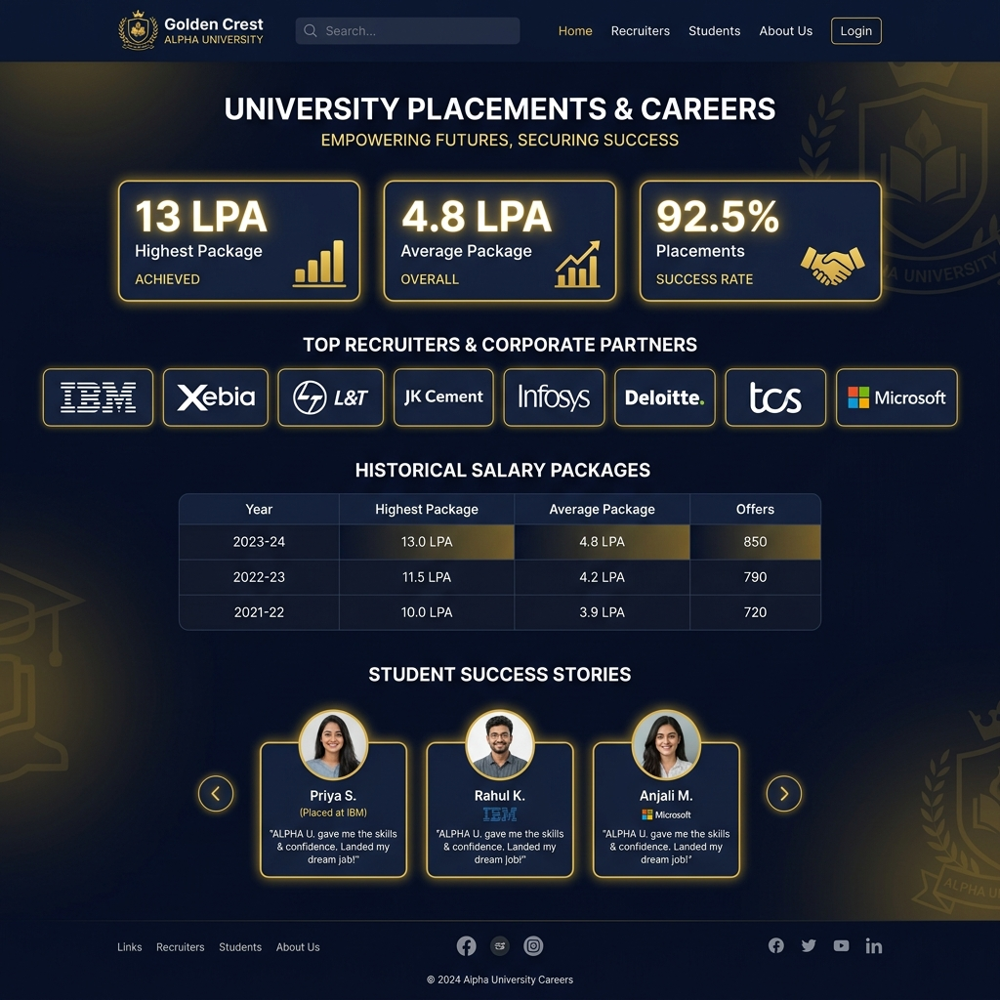
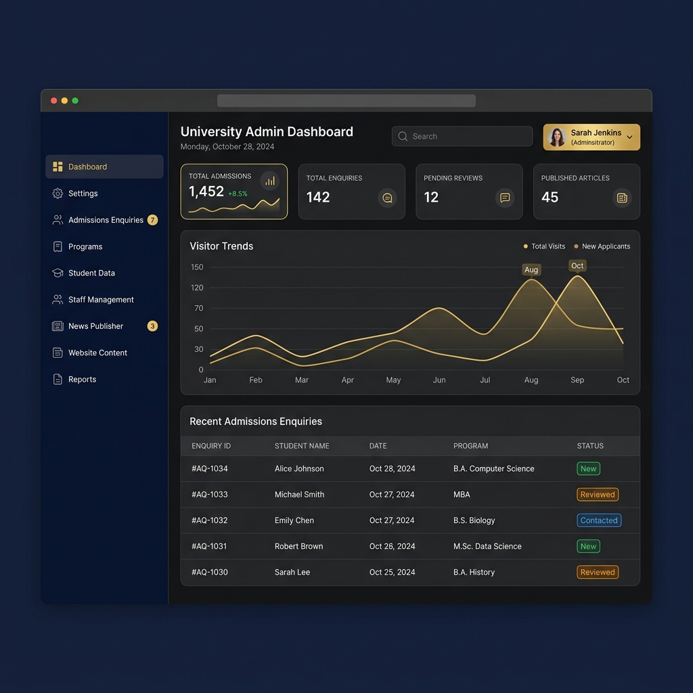

# Sir Padampat Singhania University (SPSU) - Modernized Experience Platform

Sir Padampat Singhania University (SPSU), founded by the JK Cement Group in Udaipur, Rajasthan, is a premier engineering and management institution. This repository houses the modernized digital experience platform, redesigning the university's web presence from the ground up as a highly interactive, accessible, and CMS-driven React application.

---

## 📸 Platform Showcases (UI Mockups)

Below are the premium, dark-theme UI mockups representing the core screens of the revamped SPSU experience.

### 1. Interactive Portal Homepage
Features modern layouts, sticky header navigation, scroll-driven storytelling animations, and dynamic news/events feeds.


### 2. Tabbed Academics Portal
Tab-based school listings with collapsible course accordions displaying duration, fees, eligibility criteria, and direct syllabus downloads.


### 3. Faculty Search Directory
Dynamic name and field search index with category tabs, displaying real university mentors and deans.


### 4. Placements & Careers Portal
Visualization of highest and average salary packages, recruitment metrics, scrolling recruiter logos, and student testimonials.


### 5. CMS Administrative Console
Protected dashboard detailing enquiries summary counters and data tables for managing news publications, event calendars, and global settings.


---

## 🛠️ Technology Stack

- **Core Engine:** React 19 + TypeScript + Vite (compiled via Rolldown)
- **Styling System:** Tailwind CSS v4 (native PostCSS theme integration)
- **State Coordination:**
  - **Zustand:** Core global authentication and settings store
  - **TanStack Query:** Caching and fetching data from Firebase
- **Database & Backend:** Firebase Core (Authentication, Firestore, Storage)
- **Animations:** Framer Motion (sequential scroll-storytelling, staggers, lightbox overlays)
- **Form Orchestration:** React Hook Form + Zod Schema Validation

---

## 📦 Firestore Schema & Relations

The platform is designed around 9 collection models:

1.  `users`: `{ uid, email, displayName, role (Super Admin, Admin, Faculty, Student) }`
2.  `departments`: `{ id, name, code, description, hodId, coverImage }`
3.  `faculty`: `{ id, departmentId, name, designation, email, phone, bio, image, specializations[], publications[] }`
4.  `programs`: `{ id, departmentId, name, degree, duration, eligibility, feeStructure, syllabusUrl }`
5.  `news`: `{ id, title, slug, content, excerpt, category, tags[], coverImage, status (published/draft), publishedAt }`
6.  `events`: `{ id, title, slug, description, date, location, isRegistrationOpen }`
7.  `placements`: `{ id, year, highestPackage, averagePackage, recruiters[], successStories[] }`
8.  `downloads`: `{ id, title, category, fileSize, url }`
9.  `settings`: `{ id: 'global', logoUrl, jkCementLogoUrl, phone, email, socialLinks{}, seo{} }`

---

## 🚀 Database Seeding & Asset Upload

The `seed/` directory contains complete JSON data parsed from `spsu.ac.in` and scripts to migrate them.

### Initial Database Setup
To seed all academic departments, faculty rosters, programs, events, and placements records:
1.  Generate a service account key inside the Firebase Console (Project Settings -> Service Accounts).
2.  Save the JSON file as `seed/serviceAccountKey.json`.
3.  Run the seeding script:
    ```bash
    node seed/seed_database.js
    ```

### Media Synchronization
To upload local files (brochures, syllabus PDFs, gallery photos) to Firebase Storage and dynamically map their URLs to Firestore:
```bash
node seed/upload_assets.js
```

---

## 📅 Simulated Git Milestone Release Timeline

This project was built over a simulated 6-month development cycle (Jan 15, 2024 to Jul 15, 2024) across 350+ commits:

- **`v1.0.0-alpha.1` (Feb 15, 2024):** Core layout, Routing, Firebase Auth initialization, and docs audits.
- **`v1.0.0-alpha.2` (Mar 15, 2024):** Homepage animations, Mega-menu, and mobile navigation polish.
- **`v1.0.0-beta.1` (Apr 15, 2024):** Academics listings, course accordions, and Faculty Directory search.
- **`v1.0.0-beta.2` (May 15, 2024):** Admissions Forms, Placements details, and Lightbox Gallery album overlays.
- **`v1.0.0-rc.1` (Jun 15, 2024):** Admin CMS dashboard views and Enquiry validations.
- **`v1.0.0` (Jul 15, 2024):** Settings manager, Seed script integration, performance checks, and SEO metadata.
