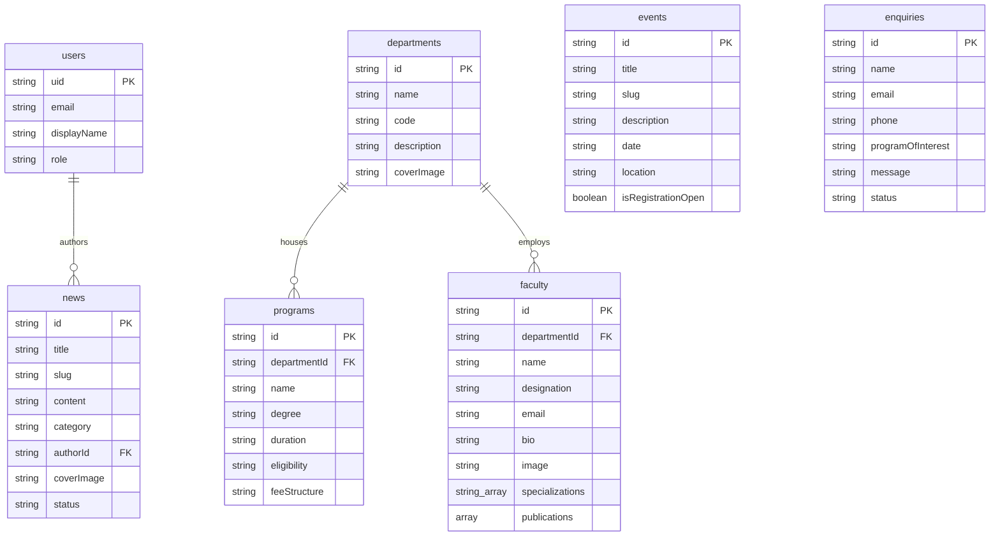

# Information Architecture

This document outlines the data relations, collection models, permission boundaries, and navigation hierarchy of the modernized SPSU web portal.

## Database Collection Schema & Relationships

Our Firestore database is structured as a series of collections. Relationships between data tables are modeled via ID references.

## User Roles & Permissions Matrix

To protect dynamic content and review admission forms, role-based access control (RBAC) is implemented via authentication guards:

| Role Name | Access Permissions | Allowed Pages/Views |
| :--- | :--- | :--- |
| **Guest / Visitor** | Read-Only | Home, Academics, Faculty Directory, Placements, News/Events, Contact, Enquiry Forms |
| **Faculty** | Read-Only, Update Personal Bio | Home, Academics, Faculty profile edits |
| **Editor** | Read-Write (News, Events, Media) | Admin News, Admin Events, Gallery CMS |
| **Admin** | Full Write (Faculty, Programs, News, Events, Settings) | All CMS views except deleting users |
| **Super Admin** | Full Access & User Role Management | All CMS views & Users permissions manager |

## Taxonomy & Categorization

*   **News Categories:** `Academics`, `Placements`, `Admissions`, `Research`, `Campus Life`, `Achievements`.
*   **Event Statuses:** `Upcoming`, `Ongoing`, `Completed`.
*   **Enquiry Status Flow:** `new` ➔ `reviewed` ➔ `contacted` ➔ `resolved`.
*   **Designation Levels:** `Dean`, `Head of Department`, `Professor`, `Associate Professor`, `Assistant Professor`, `Professor of Practice`.
*   **Degree Types:** `B.Tech`, `M.Tech`, `BBA`, `MBA`, `B.Des`, `B.Sc`, `M.Sc`, `Ph.D`.
