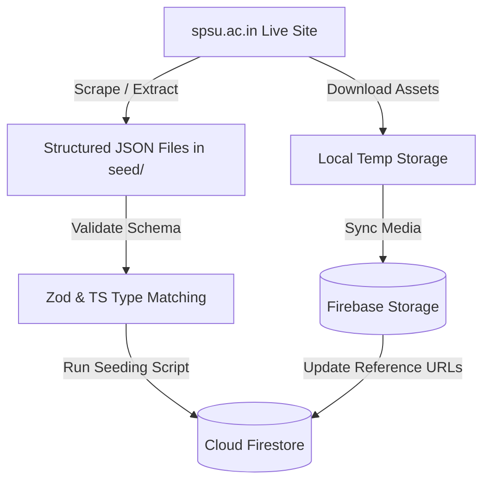

# Content Migration Plan

This document outlines the operational roadmap for extracting, restructuring, seeding, and syncing content from the live Sir Padampat Singhania University (SPSU) site into our revamped, Firebase-backed digital experience platform.

## Migration Flow

## Step-by-Step Migration Process

### Step 1: Content Scrape & Extraction
Extract structural and text nodes from `spsu.ac.in`. This includes gathering:
- Active departments and course names.
- Dynamic listings for news alerts and upcoming events.
- Faculty profiles, including research publications.
- Placement statistics and corporate partnerships.

### Step 2: Schema Modeling & JSON Staging
Convert raw text and HTML structures into normalized JSON schemas located under `seed/`.
- Ensure dates conform to ISO-8601 formatting.
- Map relationships (e.g. `faculty.departmentId` matches the corresponding `departments.id`).

### Step 3: Firebase Seeding Script Execution
Execute the database synchronization script `seed/seed_database.js` which:
1.  Clears old/stale records from target Firestore collections.
2.  Batches records into chunks of 500 writes to respect Firestore's batch limits.
3.  Injects structural collections: `departments`, `programs`, `faculty`, `placements`, `news`, `events`, `gallery_albums`, and `settings`.
4.  Logs success outputs or validation errors.

### Step 4: Asset Upload & Storage Mapping
For documents (e.g., syllabus PDFs, brochures) and galleries:
- Download files locally or point directly to original references.
- Upload media to the Firebase Cloud Storage bucket.
- Store public HTTPS download URLs returned from Firebase Storage inside the matching Firestore records.

---

## Data Synchronization & CMS Updates

Once initial data is seeded, ongoing changes are managed directly within the custom CMS Admin Panel:
*   **Enquiries Form:** Pushes name, phone, email, and program interest instantly to the `enquiries` Firestore collection.
*   **CMS Dashboard:** Allows admins to create new articles (`news`), calendar entries (`events`), and adjust site settings, immediately writing updates back to Firestore and keeping the public SPA pages in sync.
